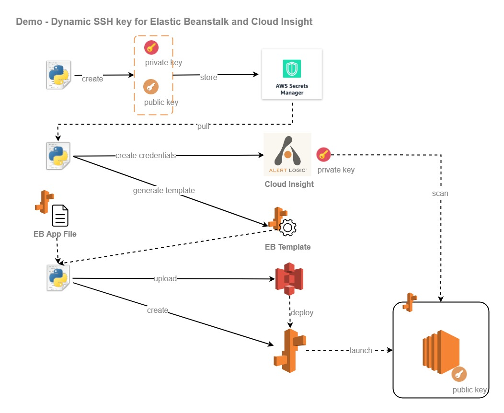

# Demo SSH Key rotation for Elastic Beanstalk and Cloud Insight

Proof of concept demo on how to utilize AlertLogic API to dynamically perform SSH key rotation and updates scan credentials in Cloud Insight.
This sample will utilize AWS Elastic Beanstalk as compute platform and AWS Secret Manager to store credentials. You will be charged for AWS resource deployed from this example.



AlertLogic API end-point used in this demonstration:

* Cloud Insight API (https://console.cloudinsight.alertlogic.com/api/#/)

## Requirements
* Alert Logic Account ID (CID)
* Credentials to Alert Logic Cloud Insight (user name and password, or access key and secret key)
* Cloud Insight Deployment in the target CID

## Getting Started
You can't use the example python code as-is, please update the global variables inside the code to fit your AWS environment, including but not limited to: vpc-id, aws kms key, application name, environment name, etc.

### Sample usage:
To launch new setup:
```
python eb_ssh_demo_replace.py --mode ADD --user $EMAIL_ADDRESS --pswd $PASSWORD --dc defender-us-denver --cid $CID --env $ENVID
```

To rotate key on existing setup:
```
python eb_ssh_demo_replace.py --mode REPLACE --user $EMAIL_ADDRESS --pswd $PASSWORD --dc defender-us-denver --cid $CID --env $ENVID
```

To verify results:
* Use the output from the script and store the private key as .pem file
* Use the private key and try to SSH to the ec2 instance from the Elastic Beanstalk: `ssh -i $PRIVATE_PEM alertlogic@$PUBLIC_IP`
* Use AWS CLI to describe the secret: `aws secretsmanager describe-secret --secret-id $SECRET_ID`
* Login to CLoud Insight portal, check the scan credentials from the topology menu

## How it works
* The script will generate private and public key and store it inside AWS Secret Manager using `vpc_id` as the secret-id
* The Elastic Beanstalk template will store environment variables called `$SSH_KEY` with value from the public key
* The Elastic Beanstalk app has .ebextension `01_add_ssh.config` that will provision user `alertlogic` and use the latest public key `$SSH_KEY`
* Using Cloud Insight API, you can store the private key as scan credentials and set the scope, i.e. per vpc-id
